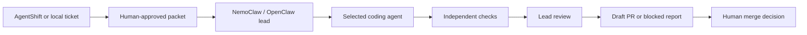

# Autonomous Development

Turn approved development tickets into reviewed code candidates while keeping people in charge of merging.

**Experimental alpha · Apache 2.0 · Linux execution host**

[Quickstart](docs/alpha-quickstart.md) · [Ticket format](docs/executable-tickets.md) · [Runtime evidence](docs/native-agent-trials.md) · [Releases](https://github.com/IntelIP/autonomous-development/releases) · [Contributing](CONTRIBUTING.md)

For developers and small teams exploring off-hours engineering. NemoClaw/OpenClaw acts as the technical lead. Pi, Codex, Claude Code, or OpenCode implements a bounded assignment. A controller runs independent checks and asks the lead to review the exact code. Passing all gates produces a draft pull request for human review.



## What works today

- A real Pi product workflow reached an approved draft PR with operator assistance.
- Four agent adapters share the task, authority, and result contract. Each run selects one runtime; mixed-runtime teams are not implemented.
- Workers have separate branches and explicit writable files. They receive no GitHub publishing credentials or host Docker socket.
- Approval binds the ticket and runtime configuration. Runs have worker, repair, and time limits. Failure is preserved.

**Not yet proven:** reliable unattended delivery or a complete fresh-host installation. Codex, OpenCode, and local-model Claude Code product trials were rejected during lead review. Native CLI availability and passing tests alone do not establish successful delivery. See the [evidence](docs/native-agent-trials.md).

## Try the synthetic example

Execution requires Linux or supported Windows WSL, Python 3.11+, Git, Docker, authenticated GitHub CLI, a healthy NemoClaw/OpenShell lead, and an existing coding-agent account. macOS can remain your planning and review machine; direct controller execution there is unvalidated. This repository does not install NemoClaw or create accounts.

```sh
export AGENT=codex
export AGENT_VERSION=0.155.1
docker build -f agent/Dockerfile.runtime --build-arg AGENT="$AGENT" --build-arg AGENT_VERSION="$AGENT_VERSION" -t "ad-worker:$AGENT-$AGENT_VERSION" .
python3 scripts/prepare-demo.py --directory /srv/ad-demo --github-repository YOUR_OWNER/YOUR_DEMO_REPO --stack-root "$PWD" --agent codex --model gpt-6-sol --image ad-worker:codex-0.155.1 --workflow bugfix
```

This seeds an intentionally incorrect sum, committed checks, and a synthetic ticket. It does not create a remote repository or start an engineer. Follow the [quickstart](docs/alpha-quickstart.md) to configure the lead, publish the seed, review and approve the packet, and run the workflow.

## Boundaries

Pi's full profile uses its existing extensions. Other agents keep their own tool systems. Agent adapters do not imply identical features or quality. Outbound network allowlisting for worker containers is not implemented. Use test repositories and scoped credentials. Third-party CLIs, images, and account access retain their own terms.

## Support and license

This is the canonical development repository for Autonomous Development. Controller tests, source packaging, operating services, and the preserved synthetic demo are maintained here. Run `python3 scripts/validate-poc.py` and `bash scripts/check-dead-code.sh` before opening a pull request; GitHub runs these checks on pull requests and on `main`.

Maintained by Hudson Aikins / IntelIP. Use [issues](https://github.com/IntelIP/autonomous-development/issues) for redacted bugs and reproducible examples. No response-time or production-support commitment is made. See [SECURITY.md](SECURITY.md) for sensitive reports.

Project source and the five explicitly identified bundled worker files use [Apache License 2.0](LICENSE). The export contains no private ticket records, account caches, or private repository history.
